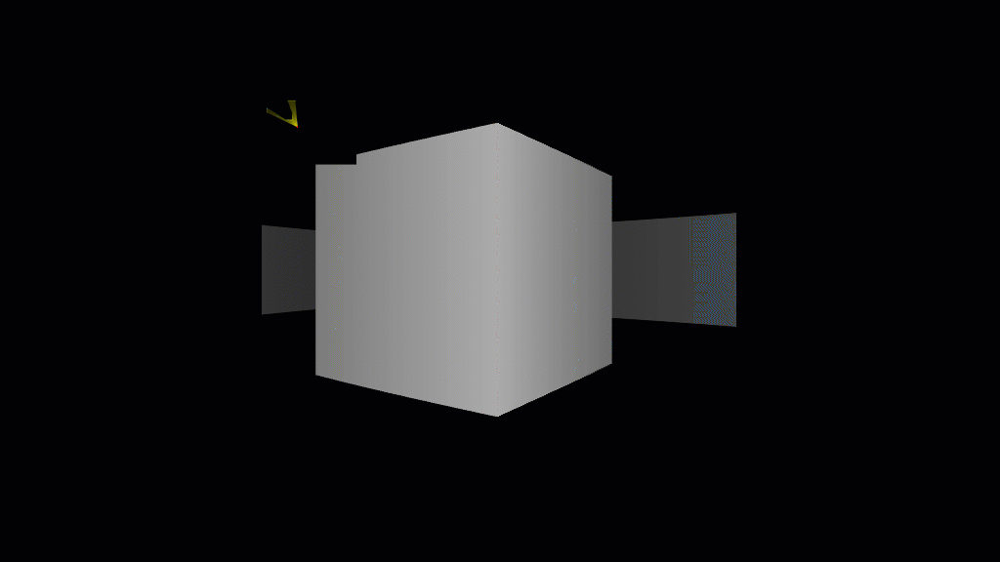

# Raycasting 3D

A  3D renderer using raycasting, inspired by the game Wolfenstein 3D. Click [here](https://razinreaz.github.io/raycasting-3D/) to interact.

# How to run locally
- clone the repository
- open `index.html` in Mozilla Firefox Web Browser
# Controls
- use the arrow keys to move

# Acknowledgements
- [Code-It-Yourself! First Person Shooter (javidx9)](https://www.youtube.com/watch?v=xW8skO7MFYw)